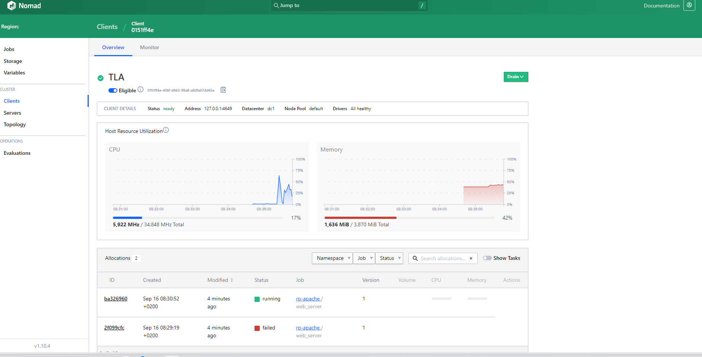

# Auto scaling 

A défaut de ne pas utiliser le plugins auto-scaler de Nomad sur la version community

On a prévu une suite de scripts python nous permettant de scale up/down les replicas de job nomad

- `python3 auto_scale.py`  : Commande d'exécution 
- `auto_scale.py`  : Fichier de scale up/down 
- `scale_modulus.py`  : Module de traitement (récupère le <nom-Guid> du réplica de service | et ses resources en cours de consommation)
- `job.json`  : C'est une representation en json du fichier HCL d'un job nomad

