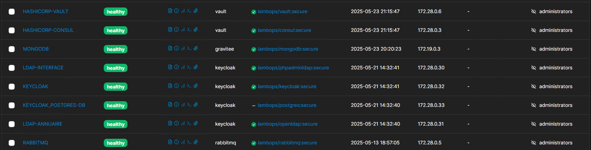

This table summarizes all Docker services deployed in the infrastructure, along with their static IP addresses, network associations, and shared volumes for persistent or inter-service communication.

| **Service**          | **IP Address**   | **Network**    | **Shared Volumes**       | **Description**                                                                   |
| -------------------- | ---------------- | -------------- | ------------------------ | --------------------------------------------------------------------------------- |
| **Envoy**            | 172.21.0.3       | –              | –                        | High-performance proxy used as reverse proxy and load balancer.                   |
| **MongoDB**          | 172.19.0.3       | –              | –                        | NoSQL database used to persist structured/unstructured data.                      |
| -------------------- | ---------------- | -------------- | ------------------------ | --------------------------------------------------------------------------------- |
| **Redis**            | 172.28.0.2       | `net_api`      | –                        | In-memory cache system used for fast token and session storage.                   |
| **Consul**           | 172.28.0.3       | `net_api`      | ✔ (`!= null`)            | Service discovery and configuration tool used to register and track services.     |
| **Nomad**            | 172.28.0.4       | `net_api`      | ✔ (`!= null`)            | HashiCorp's scheduler for deploying and managing containerized workloads.         |
| **RabbitMQ**         | 172.28.0.5       | `net_api`      | ✔ (`!= null`)            | Asynchronous message broker enabling communication between services.              |
| **Vault**            | 172.28.0.6       | `net_api`      | ✔ `shared-secret`        | Secure secret management service to store tokens, passwords, and credentials.     |
| **Nexus**            | 172.28.0.7       | `net_api`      | –                        | Artifact repository used to host Docker images and NuGet/npm packages.            |
| -------------------- | ---------------- | -------------- | ------------------------ | --------------------------------------------------------------------------------- |
| **Otel-Collector**   | 172.28.0.13      | –              | –                        | OpenTelemetry Collector for metrics and traces aggregation.                       |
| **Prometheus**       | 172.28.0.14      | –              | –                        | Monitoring tool used to scrape and store time-series metrics.                     |
| **Grafana**          | 172.28.0.15      | –              | –                        | Visualization tool for dashboards and alerts (connected to Prometheus).           |
| **Node Exporter**    | 172.28.0.16      | –              | –                        | Prometheus exporter for hardware and OS metrics from host systems.                |
| -------------------- | ---------------- | -------------- | ------------------------ | --------------------------------------------------------------------------------- |
| **Gravitee Gateway** | 172.28.0.17      | –              | –                        | API Gateway component of Gravitee for request routing and rate limiting.          |
| **Gravitee API**     | 172.28.0.18      | –              | ✔ `shared-secret`        | Management API for Gravitee, used to configure and publish APIs.                  |
| **Gravitee UI**      | 172.28.0.19      | –              | –                        | User interface for managing Gravitee APIs and policies.                           |
| -------------------- | ---------------- | -------------- | ------------------------ | --------------------------------------------------------------------------------- |
| **PhpLDAPadmin**     | 172.28.0.30      | –              | –                        | Web UI to manage LDAP users and groups visually.                                  |
| **OpenLDAP**         | 172.28.0.31      | –              | –                        | Lightweight directory service for storing user credentials.                       |
| **Keycloak**         | 172.28.0.32      | –              | ✔ `shared-secret`        | Identity and access management service, main authentication provider.             |
| **PG-Keycloak**      | 172.28.0.33      | –              | –                        | PostgreSQL database backend used by Keycloak for storing user metadata.           |

Tableau récapitualif des API backend
-----------------------------------------------------------------------------------
| Backend API    | Ip Address    | Réseau                | Nugget Packages        |
| ---------------| --------------|-----------------------|----------------------- |
| **Team**       |172.25.0.4     |                       |`CustomVaultPackage`    |
|                |               |                       |                        |
| **Project**    |172.25.0.5     |                       |                        |
|                |               |                       |                        |
| **Auth**       |172.25.0.3     |                       |                        |
-----------------------------------------------------------------------------------

