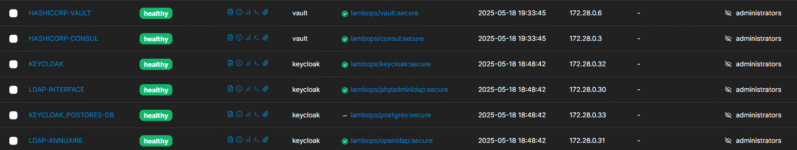

Tableau récapitulatif des services docker et leurs ip statiques 

-----------------------------------------------------------------------------------
| Services       | Ip Address    | Réseau                | Shared Volumes         |
| ---------------| --------------|-----------------------|------------------------|
| **Envoy**      |172.21.0.3     |                       |                        |
|                |               |                       |                        |
| **MongoDB**    |172.19.0.3     |                       |                        |
|****************|***************|***********************|************************|
| **Redis**      |172.28.0.2     |net_api                |                        |
|                |               |                       |                        |
| **Consul**     |172.28.0.3     |net_api                |`Responsable != null`   |
|                |               |                       |                        |
| **Nomad**      |172.28.0.4     |net_api                |`Responsable != null`   |
|                |               |                       |                        |
| **RabbitMQ**   |172.28.0.5     |net_api                |`Responsable != null`   |
|                |               |                       |                        |
| **Vault**      |172.28.0.6     |net_api                | `shared-secret`        |
|                |               |                       |                        |
| **Nexus**      |172.28.0.7     |net_api                |                        |
|****************|***************|***********************|************************|
|**Otel-collec** |172.28.0.13    |                       |                        |
|                |               |                       |                        |
|**Prometheus**  |172.28.0.14    |                       |                        |
|                |               |                       |                        |
|**Grafana**     |172.28.0.15    |                       |                        |
|                |               |                       |                        |
|**node_exporter**|172.28.0.16   |                       |                        |
|****************|***************|***********************|************************|
|**Gravitee-gateway**|172.28.0.17|                       |                        |
|                |               |                       |                        |
|**Gravitee-API**|172.28.0.18    |                       | `shared-secret`        |
|                |               |                       |                        |
|**Gravitee-UI** |172.28.0.19    |                       |                        |
|****************|***************|***********************|************************|
|**Phpadminldap**|172.28.0.30    |                       |                        |
|                |               |                       |                        |
|**Openldap**    |172.28.0.31    |                       |                        |
|                |               |                       |                        |
|**Keycloak**    |172.28.0.32    |                       | `shared-secret`        |
|                |               |                       |                        |
|**Postgres-key**|172.28.0.33    |                       |                        |
-----------------------------------------------------------------------------------

Tableau récapitualif des API backend
-----------------------------------------------------------------------------------
| Backend API    | Ip Address    | Réseau                | Nugget Packages        |
| ---------------| --------------|----------------------------------------------- |
| **Team**       |172.25.0.4     |                       |`CustomVaultPackage`    |
|                |               |                       |                        |
| **Project**    |172.25.0.5     |                       |                        |
-----------------------------------------------------------------------------------
